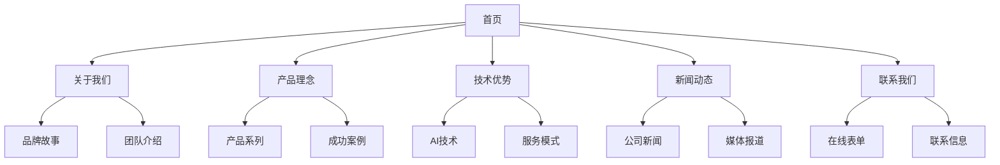

# ASUPET企业官网产品需求文档

## 1. 产品概述

ASUPET企业官网是一个专业的品牌展示型网站，旨在全面展示ASUPET作为"科技驱动的专业宠物消费新生态"品牌的核心价值。网站面向潜在客户、合作伙伴、媒体和投资方，通过现代化的设计和技术实现，传达品牌的专业性和科技感。

项目目标是打造一个高端、专业的企业形象展示平台，支持中英文双语，具备优秀的用户体验和SEO表现。

## 2. 核心功能

### 2.1 用户角色

| 角色 | 访问方式 | 核心权限 |
|------|----------|----------|
| 普通访客 | 直接访问 | 浏览所有公开内容，查看品牌信息，使用联系表单 |
| 网站管理员 | 后台登录 | 内容管理，新闻发布，表单数据查看，多语言内容编辑 |

### 2.2 功能模块

我们的ASUPET企业官网包含以下主要页面：

1. **首页**：品牌价值主张展示区、核心优势概览、最新动态预览、快速导航区
2. **关于我们**：品牌故事、创立理念与使命愿景、发展历程、专业团队介绍
3. **产品理念**：三大产品系列展示、营养特点说明、适用场景介绍、成功案例展示
4. **技术优势**：AI个性化推荐系统、数据安全保障、技术团队介绍、服务模式说明
5. **新闻动态**：公司新闻、行业观点、媒体报道、资质认证展示
6. **联系我们**：公司信息、合作咨询、媒体联系、在线表单

### 2.3 页面详情

| 页面名称 | 模块名称 | 功能描述 |
|----------|----------|----------|
| 首页 | 品牌价值主张展示区 | 展示"因宠而异"核心理念，突出科技驱动的专业定位 |
| 首页 | 核心优势概览 | 快速展示AI技术、专业团队、双地服务等核心优势 |
| 首页 | 最新动态预览 | 显示最新3-5条新闻动态，支持分类筛选 |
| 首页 | 快速导航区 | 提供主要页面的快速入口，优化用户体验 |
| 关于我们 | 品牌故事 | 讲述ASUPET创立背景和发展历程，建立情感连接 |
| 关于我们 | 创立理念与使命愿景 | 阐述品牌核心价值观和未来发展目标 |
| 关于我们 | 发展历程 | 时间轴展示重要里程碑和成就 |
| 关于我们 | 专业团队介绍 | 展示营养师团队资质、背景和专业认证 |
| 产品理念 | 三大产品系列展示 | 详细介绍各产品系列的特点和适用场景 |
| 产品理念 | 营养特点说明 | 科学解释产品营养价值和配方优势 |
| 产品理念 | 适用场景介绍 | 展示不同宠物类型和生活场景的应用 |
| 产品理念 | 成功案例展示 | 真实案例分享，展示产品效果（非交易数据） |
| 技术优势 | AI个性化推荐系统 | 详细说明AI算法原理和个性化推荐优势 |
| 技术优势 | 数据安全保障 | 展示数据保护措施和隐私安全承诺 |
| 技术优势 | 技术团队介绍 | 介绍技术团队背景和研发能力 |
| 技术优势 | 服务模式说明 | 阐述订阅制服务和双地服务模式 |
| 新闻动态 | 公司新闻 | 发布公司最新动态和重要公告 |
| 新闻动态 | 行业观点 | 分享行业洞察和专业观点 |
| 新闻动态 | 媒体报道 | 展示第三方媒体对品牌的报道 |
| 新闻动态 | 资质认证展示 | 显示相关证书、奖项和认证信息 |
| 联系我们 | 公司信息 | 展示公司地址、联系方式和营业时间 |
| 联系我们 | 合作咨询 | 提供商务合作联系方式和流程 |
| 联系我们 | 媒体联系 | 专门的媒体联系渠道和新闻资料 |
| 联系我们 | 在线表单 | 支持多种咨询类型的在线提交表单 |

## 3. 核心流程

**普通访客流程：**
访客通过首页了解品牌核心价值 → 浏览关于我们页面深入了解品牌故事 → 查看产品理念了解产品特色 → 访问技术优势页面了解专业实力 → 通过新闻动态获取最新信息 → 使用联系我们页面进行咨询或合作洽谈

**管理员流程：**
管理员登录后台系统 → 管理网站内容（新闻、团队信息、产品信息） → 查看和处理用户提交的联系表单 → 更新多语言内容 → 监控网站性能和用户反馈

## 4. 用户界面设计

### 4.1 设计风格

- **主色调：** 科技蓝(#2563eb) + 活力橙(#f97316)
- **辅助色：** 自然绿(#10b981)、中性灰(#6b7280)
- **按钮样式：** 圆角设计，支持主要、次要、轮廓三种样式
- **字体：** 中文使用PingFang SC，英文使用Inter，确保清晰易读
- **布局风格：** 卡片式设计，顶部导航，清晰的信息层次
- **图标风格：** 简洁现代的线性图标，配合品牌色彩

### 4.2 页面设计概览

| 页面名称 | 模块名称 | UI元素 |
|----------|----------|--------|
| 首页 | 品牌价值主张展示区 | 大尺寸Hero Banner，渐变背景(科技蓝到活力橙)，白色标题文字，CTA按钮 |
| 首页 | 核心优势概览 | 三栏卡片布局，图标+标题+描述，悬停效果，阴影设计 |
| 首页 | 最新动态预览 | 网格布局，缩略图+标题+摘要，"查看更多"链接 |
| 关于我们 | 品牌故事 | 左右分栏，文字+配图，时间轴设计，渐进式展示 |
| 关于我们 | 团队介绍 | 人员卡片，圆形头像，姓名+职位+简介，专业认证标识 |
| 产品理念 | 产品系列展示 | 大图展示，产品特点标签，营养成分图表，适用宠物图标 |
| 技术优势 | AI技术展示 | 流程图设计，动画效果，技术特点说明，数据可视化 |
| 新闻动态 | 新闻列表 | 列表+网格切换，分类筛选，搜索功能，分页导航 |
| 联系我们 | 联系表单 | 清晰的表单设计，必填项标识，实时验证，提交状态反馈 |

### 4.3 响应式设计

网站采用移动优先的响应式设计策略，支持从手机到大屏桌面的完美适配。断点设置：640px(手机)、768px(平板)、1024px(笔记本)、1280px(桌面)。移动端优化包括触摸友好的交互、简化的导航菜单和优化的图片加载。