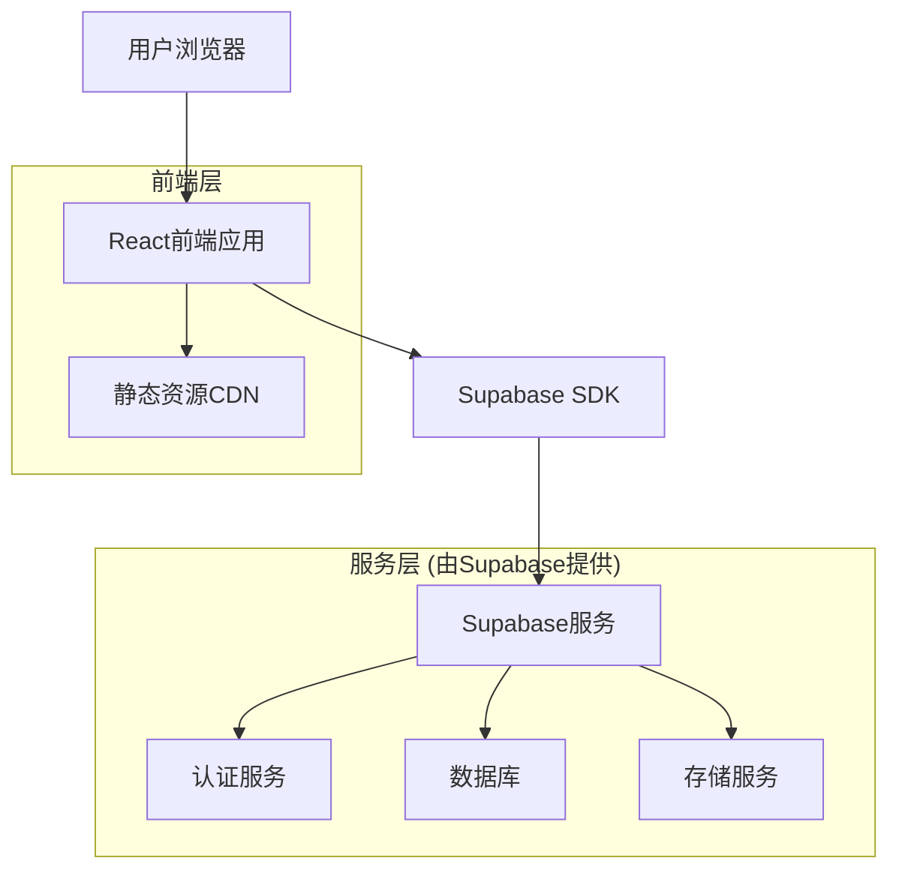
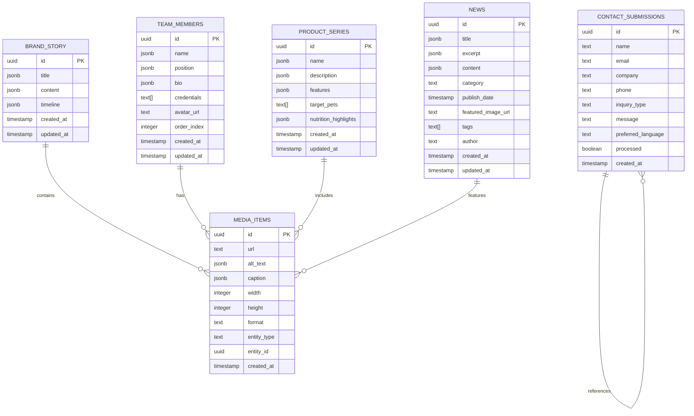

# ASUPET企业官网技术架构文档

## 1. 架构设计



## 2. 技术描述

* **前端：** React\@18 + TypeScript + Tailwind CSS + Vite

* **后端：** Supabase (提供数据库、认证、存储服务)

* **状态管理：** Zustand

* **表单处理：** React Hook Form + Zod验证

* **国际化：** React-i18next

* **部署：** Vercel

## 3. 路由定义

| 路由          | 用途                 |
| ----------- | ------------------ |
| /           | 首页，展示品牌价值主张和核心优势概览 |
| /about      | 关于我们页面，展示品牌故事和团队介绍 |
| /products   | 产品理念页面，展示产品系列和营养特点 |
| /technology | 技术优势页面，展示AI技术和服务模式 |
| /news       | 新闻动态页面，展示公司新闻和行业观点 |
| /news/:id   | 新闻详情页面，展示具体新闻内容    |
| /contact    | 联系我们页面，提供联系信息和在线表单 |
| /admin      | 管理后台入口（如需要）        |

## 4. API定义

### 4.1 核心API

**内容管理相关**

获取品牌故事

```
GET /api/brand-story
```

响应：

| 参数名称      | 参数类型   | 描述                             |
| --------- | ------ | ------------------------------ |
| id        | string | 内容ID                           |
| title     | object | 多语言标题 {zh: string, en: string} |
| content   | object | 多语言内容 {zh: string, en: string} |
| images    | array  | 相关图片数组                         |
| updatedAt | string | 更新时间                           |

获取团队成员

```
GET /api/team-members
```

响应：

| 参数名称        | 参数类型   | 描述     |
| ----------- | ------ | ------ |
| id          | string | 成员ID   |
| name        | object | 多语言姓名  |
| position    | object | 多语言职位  |
| bio         | object | 多语言简介  |
| avatar      | string | 头像URL  |
| credentials | array  | 专业资质数组 |

获取新闻列表

```
GET /api/news?category={category}&limit={limit}
```

请求参数：

| 参数名称     | 参数类型   | 是否必需  | 描述                            |
| -------- | ------ | ----- | ----------------------------- |
| category | string | false | 新闻分类 (company/industry/media) |
| limit    | number | false | 返回数量限制                        |

响应：

| 参数名称          | 参数类型   | 描述      |
| ------------- | ------ | ------- |
| id            | string | 新闻ID    |
| title         | object | 多语言标题   |
| excerpt       | object | 多语言摘要   |
| category      | string | 新闻分类    |
| publishDate   | string | 发布日期    |
| featuredImage | string | 特色图片URL |

提交联系表单

```
POST /api/contact
```

请求：

| 参数名称              | 参数类型   | 是否必需  | 描述                               |
| ----------------- | ------ | ----- | -------------------------------- |
| name              | string | true  | 联系人姓名                            |
| email             | string | true  | 邮箱地址                             |
| company           | string | false | 公司名称                             |
| phone             | string | false | 电话号码                             |
| inquiryType       | string | true  | 咨询类型 (partnership/media/general) |
| message           | string | true  | 留言内容                             |
| preferredLanguage | string | true  | 首选语言 (zh/en)                     |

响应：

| 参数名称    | 参数类型    | 描述   |
| ------- | ------- | ---- |
| success | boolean | 提交状态 |
| message | string  | 响应消息 |

示例：

```json
{
  "name": "张三",
  "email": "zhangsan@example.com",
  "company": "ABC公司",
  "inquiryType": "partnership",
  "message": "希望了解合作机会",
  "preferredLanguage": "zh"
}
```

## 5. 数据模型

### 5.1 数据模型定义



### 5.2 数据定义语言

**品牌故事表 (brand\_story)**

```sql
-- 创建表
CREATE TABLE brand_story (
    id UUID PRIMARY KEY DEFAULT gen_random_uuid(),
    title JSONB NOT NULL, -- {"zh": "中文标题", "en": "English Title"}
    content JSONB NOT NULL, -- {"zh": "中文内容", "en": "English Content"}
    timeline JSONB, -- 时间轴数据
    created_at TIMESTAMP WITH TIME ZONE DEFAULT NOW(),
    updated_at TIMESTAMP WITH TIME ZONE DEFAULT NOW()
);

-- 创建索引
CREATE INDEX idx_brand_story_updated_at ON brand_story(updated_at DESC);

-- 权限设置
GRANT SELECT ON brand_story TO anon;
GRANT ALL PRIVILEGES ON brand_story TO authenticated;
```

**团队成员表 (team\_members)**

```sql
-- 创建表
CREATE TABLE team_members (
    id UUID PRIMARY KEY DEFAULT gen_random_uuid(),
    name JSONB NOT NULL,
    position JSONB NOT NULL,
    bio JSONB,
    credentials TEXT[],
    avatar_url TEXT,
    order_index INTEGER DEFAULT 0,
    created_at TIMESTAMP WITH TIME ZONE DEFAULT NOW(),
    updated_at TIMESTAMP WITH TIME ZONE DEFAULT NOW()
);

-- 创建索引
CREATE INDEX idx_team_members_order ON team_members(order_index ASC);

-- 权限设置
GRANT SELECT ON team_members TO anon;
GRANT ALL PRIVILEGES ON team_members TO authenticated;
```

**产品系列表 (product\_series)**

```sql
-- 创建表
CREATE TABLE product_series (
    id UUID PRIMARY KEY DEFAULT gen_random_uuid(),
    name JSONB NOT NULL,
    description JSONB NOT NULL,
    features JSONB,
    target_pets TEXT[],
    nutrition_highlights JSONB,
    created_at TIMESTAMP WITH TIME ZONE DEFAULT NOW(),
    updated_at TIMESTAMP WITH TIME ZONE DEFAULT NOW()
);

-- 权限设置
GRANT SELECT ON product_series TO anon;
GRANT ALL PRIVILEGES ON product_series TO authenticated;
```

**新闻表 (news)**

```sql
-- 创建表
CREATE TABLE news (
    id UUID PRIMARY KEY DEFAULT gen_random_uuid(),
    title JSONB NOT NULL,
    excerpt JSONB,
    content JSONB NOT NULL,
    category TEXT CHECK (category IN ('company', 'industry', 'media')),
    publish_date TIMESTAMP WITH TIME ZONE DEFAULT NOW(),
    featured_image_url TEXT,
    tags TEXT[],
    author TEXT,
    created_at TIMESTAMP WITH TIME ZONE DEFAULT NOW(),
    updated_at TIMESTAMP WITH TIME ZONE DEFAULT NOW()
);

-- 创建索引
CREATE INDEX idx_news_publish_date ON news(publish_date DESC);
CREATE INDEX idx_news_category ON news(category);

-- 权限设置
GRANT SELECT ON news TO anon;
GRANT ALL PRIVILEGES ON news TO authenticated;
```

**联系表单提交表 (contact\_submissions)**

```sql
-- 创建表
CREATE TABLE contact_submissions (
    id UUID PRIMARY KEY DEFAULT gen_random_uuid(),
    name TEXT NOT NULL,
    email TEXT NOT NULL,
    company TEXT,
    phone TEXT,
    inquiry_type TEXT CHECK (inquiry_type IN ('partnership', 'media', 'general')),
    message TEXT NOT NULL,
    preferred_language TEXT CHECK (preferred_language IN ('zh', 'en')),
    processed BOOLEAN DEFAULT FALSE,
    created_at TIMESTAMP WITH TIME ZONE DEFAULT NOW()
);

-- 创建索引
CREATE INDEX idx_contact_submissions_created_at ON contact_submissions(created_at DESC);
CREATE INDEX idx_contact_submissions_processed ON contact_submissions(processed);

-- 权限设置
GRANT INSERT ON contact_submissions TO anon;
GRANT ALL PRIVILEGES ON contact_submissions TO authenticated;
```

**媒体资源表 (media\_items)**

```sql
-- 创建表
CREATE TABLE media_items (
    id UUID PRIMARY KEY DEFAULT gen_random_uuid(),
    url TEXT NOT NULL,
    alt_text JSONB,
    caption JSONB,
    width INTEGER,
    height INTEGER,
    format TEXT,
    entity_type TEXT,
    entity_id UUID,
    created_at TIMESTAMP WITH TIME ZONE DEFAULT NOW()
);

-- 创建索引
CREATE INDEX idx_media_items_entity ON media_items(entity_type, entity_id);

-- 权限设置
GRANT SELECT ON media_items TO anon;
GRANT ALL PRIVILEGES ON media_items TO authenticated;
```

**初始化数据**

```sql
-- 插入示例品牌故事
INSERT INTO brand_story (title, content, timeline) VALUES (
    '{"zh": "ASUPET品牌故事", "en": "ASUPET Brand Story"}',
    '{"zh": "ASUPET致力于通过科技创新为宠物提供个性化营养解决方案...", "en": "ASUPET is committed to providing personalized nutrition solutions for pets through technological innovation..."}',
    '[{"year": "2020", "event": {"zh": "公司成立", "en": "Company Founded"}}, {"year": "2021", "event": {"zh": "AI技术研发", "en": "AI Technology Development"}}]'
);

-- 插入示例团队成员
INSERT INTO team_members (name, position, bio, credentials, order_index) VALUES 
('{"zh": "张博士", "en": "Dr. Zhang"}', '{"zh": "首席营养师", "en": "Chief Nutritionist"}', '{"zh": "拥有10年宠物营养研究经验", "en": "10 years of experience in pet nutrition research"}', ARRAY['博士学位', '注册营养师'], 1),
('{"zh": "李工程师", "en": "Engineer Li"}', '{"zh": "技术总监", "en": "Technical Director"}', '{"zh": "AI算法专家，专注个性化推荐", "en": "AI algorithm expert, focusing on personalized recommendations"}', ARRAY['硕士学位', 'AI认证'], 2);
```

